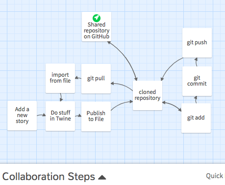

# Project 4: Collaborative Interactive Narrative

In this final project unit of the semester, you will collaborate on a team of 2-4 people to compose an **interactive narrative**: a hyperlinked series of choices giving readers a range of reading experiences. The open-source [Twine](https://twinery.org) platform allows you to do so with little more than plain text and some brackets – but also to bring in variables, conditional logic, images, CSS, and JavaScript if that's the kind of thing you're into. (A major advantage of working in teams: maybe only one of you wants to dig that deep, but you can all benefit nevertheless.)

In assigning this, I have three main goals for you: (1) to practice managing a complex project involving multiple team members; (2) to assess your own skills as a digital media composer, so as to find ways _you_ in particular can best contribute to a joint project; and (3) to integrate and consolidate the skills you've practiced across the semester.

I also hope you'll have fun with it!

As with earlier projects, the selection of content, and even genre, is your choice:  "narrative," in Twine, can include adventure or horror fiction, but also memoir, training manual, poetic meditation, and more. You're free to adapt an existing text, if you give credit to the source.

## Generative constraints
_This is a starting point; we'll discuss and update in class next week, as has been our usual process._

**Baseline criteria**
For a minimum grade of B, all projects for this unit must:

* Contain at least 20 passages.
* Have a title screen passage containing at least the story's title, the names of your team members, and a link to a credits page if appropriate.
* Have at least one clearly identifiable ending passage.
* Include at least two passages with diverging paths leading out
* Include at least one passage with converging paths leading in <!-- Jess FitzPatrick had two -->

**Aspirational inspirations**
To target (but not guarantee) a grade above a B, the best projects for this unit may...

* Use visuals to direct attention or advance a claim
* Use sound to convey a sense of place or mood
* Use Harlowe code or CSS to make at least two new "looks" for selected passages
* Use Harlowe code to store variables and/or introduce conditional logic (if/then behaviors)
* etc

## Collaborative Guidelines
Will be in another file, to keep this one straightforward. See [twine-and-collaboration.md](how-to/twine-and-collaboration.md).

Here's a summary:

## Deadlines and products
At each stage, unless otherwise specified, upload (push) your materials to your group's copy of this assignment repository. I recommend that you **save often, using meaningful commit messages**; for best results, _please keep your filenames clear, lowercase, and space-free_ (use hyphens or underscores).

If you are using Box, please nevertheless share a link to your Box folder prominently in your GitHub repository.

| date | what's due | expected files |
|----|----|----|
| Thurs, 4/4 | Group Twine Proposal | Further thinking in writing about what you'd like to do for this assignment – and how you'll collaborate / divide the workload. <ul><li>Post to a file in your repository called <strong>PROPOSAL.md</strong></li><li>Optionally, you may wish to use your repository's Project tool to make a to-do list where you can assign tasks to members of the team and keep everyone posted on progress.</li></ul> |
| Tues, 4/9 | Group Twine Preview | An early snapshot of your progress, to get the gears turning. Turn in: <ul><li>An html file exported from Twine using the <strong>Publish to File</strong> tool;</li><li>A static <strong><a href="https://www.take-a-screenshot.org/">screenshot</a> (.png or .jpg)</strong> of your narrative in progress, showing the story map of passages and links between them.</li><li>Any other files we'd need to successfully import and view your Twine – images, css to import (e.g. bootstrap), etc – should be pushed to the repo as well.</li><li>An updated README.md, explaining in at least 300 words <strong>what you're showing us</strong> in this preview. Feel free also to ask questions or lay out next steps for yourselves!</li><li>If necessary, **credits** for any assets used should be added to a clearly labeled passage in your Twine, and linked to from the title page.</li></ul> |
| Thurs, 4/11 | Workshop-Ready Draft | A solid attempt at a complete, playable game. Turn in the same components as for the Preview, but updated. |
| Tues, 4/16, at 11:59 pm | Final Draft | Turn in the same components as for the Draft, but updated. This deadline will give us one extra studio day on Tuesday 4/16, and one class day to play each other's games (and talk about the final reflection for the semester) on Thursday 4/18. |
