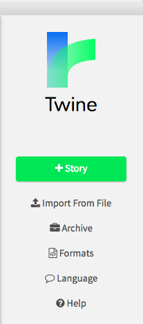
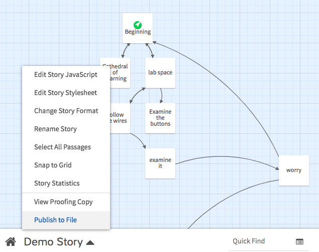
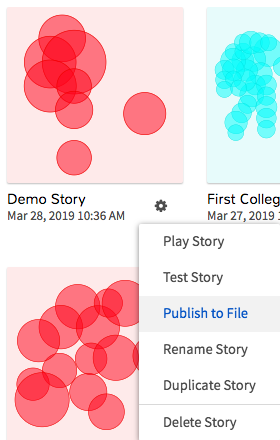

# Using GitHub to Collaborate on Twine

Twine, ordinarily speaking, is software that assumes a single author. There is no built-in cooperative editing mode. But because it uses web standards, a complete Twine game exports as a single html file. All you have to do, then, is version-control that single file, and use GitHub's collaboration tools.

Here's how it'll work:

## Setup

* Start with a shared repository on GitHub.
  - If you're reading this after forking a copy of the assignment, congratulations! You've already done this step.
  - If you need to add collaborators to a repo, you can do so on the Settings tab.
* **Clone** the repo to each of your local computers.
* Download the latest version of [Twine](http://twinery.org/), if you can and you haven't yet done so.

## First Edits
* **One of you**, fire up Twine and start a new story with the green +Story button. 
* Make a few edits: I suggest a title screen as your first passage. You can always edit it later!
  - Twine will save automatically: click outside the passage to go back to the map.
* Use the menu at the bottom left to **Publish to File**. Be sure to _save the resulting html file into your local repository folder._ 
  - Note that you can also access this export tool from the gear menu in the list of stories. 
* Using either the command line or the GitHub app, **add** the file you just exported, write a **commit** message to tell your colleagues what you've changed, and **push** your changes.

## Subsequent Edits

* Every time you start a working session, immediately **pull** from the shared repo so your local files are all up to date.
* In Twine, use the **Import from File** button, and re-import the latest version of your shared html.
* Do whatever work you want to do; when done working, or just at a good point to comment on a revision, **Publish to File** _and overwrite that same html file_ in your local repository folder.
  - Don't worry: the previous saved version is still recoverable with git!
* Using either the command line or the GitHub app, **add** the file you just exported, write a **commit** message to tell your colleagues what you've changed, and **push** your changes.

## Rinse and repeat!

Depending on how your group has decided to divide the labor, you may add some other wrinkles:

* You may be editing images or sound files, rather than working in Twine. Same principles apply, though: **pull, import, edit, save; add, commit, push.**
* You may want to tell each other when you'll be working, to make sure you don't make competing changes at the same time. Be sure you have each other's best contact info! (Phone, Slack, What'sApp, take your pick.)
* If you want to get fancy about it, you can create a new branch for your changes, and then file a _pull request_ instead of just pushing.
  - This alerts your collaborators to review your changes before merging them into the shared, official version of the file, and creates a forum space for conversation about the change.
  - To review how pull requests work, head back to Git and GitHub for Poets, [episode 2](https://www.youtube.com/watch?v=oPpnCh7InLY&vl=en) and [episode 3](https://www.youtube.com/watch?v=BCQHnlnPusY&list=PLRqwX-V7Uu6ZF9C0YMKuns9sLDzK6zoiV). (He's also got a video on [resolving merge conflicts](https://www.youtube.com/watch?v=JtIX3HJKwfo&list=PLRqwX-V7Uu6ZF9C0YMKuns9sLDzK6zoiV&index=9), if they end up unavoidable.)
